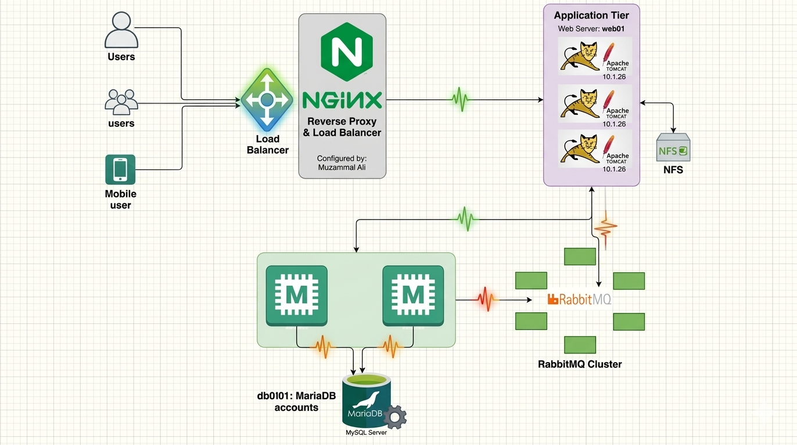

# vProfile 5-Tier Multi-Tier Architecture Project



This repository contains my hands-on implementation of a production-grade, decoupled 5-tier web application architecture. 

### 🏆 Course & Instructor Credit
This project was built as part of my practical learning and lab practice under the expert guidance and structured curriculum of **Imran Teli**. The base deployment scripts and architectural blueprints were provided as part of his DevOps training modules, which I manually configured, tested, and troubleshooted in my local environment.

---

## 🏗️ Architecture Design
The infrastructure is distributed across 5 independent virtual private nodes:
- **Nginx (web01):** Reverse proxy & frontend load balancer.
- **Apache Tomcat (app01):** Core Java application server running the compiled Maven artifact (`ROOT.war`).
- **MariaDB/MySQL (db01):** Relational SQL database storing user accounts and profile tables.
- **Memcached (mc01):** Direct memory caching tier to offload database query weights.
- **RabbitMQ (rmq01):** Asynchronous message queuing broker handles inter-service background triggers.

---

## 🛠️ Infrastructure Operations & Troubleshooting Log

Deploying the code was only half the journey. The real DevOps mastery came during infrastructure troubleshooting when addressing local environment constraints:

### 1. Network Subnet Optimization (ERR_CONNECTION_TIMED_OUT)
- **Problem:** Virtual machines pool and the host Windows laptop interface (`VMnet1`) were initialized on different network subnets, breaking communication.
- **Solution:** Re-configured the virtual interface adapters inside VMware Workstation under Administrator privileges, shifting the host subnet definitions directly to `192.168.56.0` to safely route packets between the laptop and the cluster.

### 2. Resolving Multi-Tier Port Isolation (No route to host)
- **Problem:** Cross-VM communication failed. Nginx couldn't hand requests over to port `8080` on Tomcat, and Tomcat couldn't open network pipes on port `5672` to RabbitMQ.
- **Analysis:** Built-in enterprise operating system security walls (`firewalld`) were dynamically intercepting raw port requests. 
- **Solution:** Used network tracing diagnostics (`telnet`) to isolate drops. Managed firewall routing tables across backends to create fluid socket connections.

---

## 🚀 How to Run the Automation
To cleanly set up this entire environment automatically in under 15 minutes, browse to the automated directory and trigger Vagrant:

```bash
cd vagrant/Automated_provisioning_WinMacIntel
vagrant up
